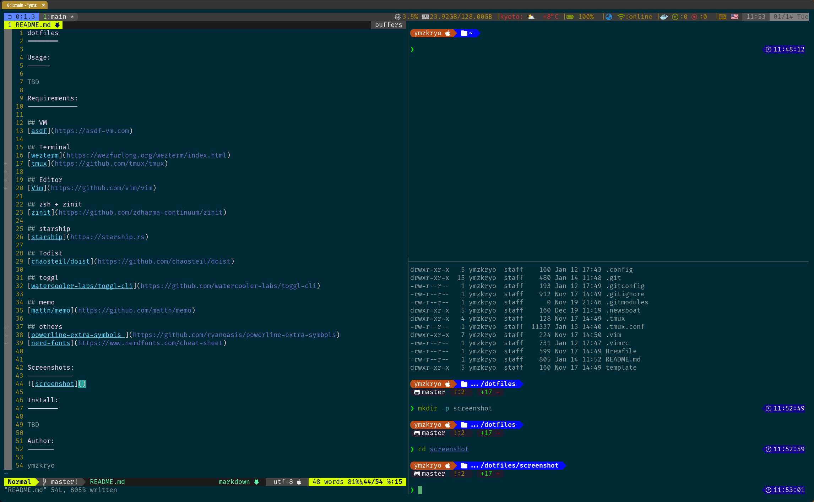

dotfiles
========

Usage:
------

### Update submodule

```bash
git submodule update --remote private
git add private
git commit -m "Update: private submodule"
```

Requirements:
-------------

## VM
[asdf](https://asdf-vm.com)

## Terminal
[wezterm](https://wezfurlong.org/wezterm/index.html)
[tmux](https://github.com/tmux/tmux)

## Editor
[Vim](https://github.com/vim/vim)

## zsh + zinit
[zinit](https://github.com/zdharma-continuum/zinit)

## starship
[starship](https://starship.rs)

## Todist
[chaosteil/doist](https://github.com/chaosteil/doist)

## toggl
[watercooler-labs/toggl-cli](https://github.com/watercooler-labs/toggl-cli)

## memo
[mattn/memo](https://github.com/mattn/memo)

## others
[powerline-extra-symbols ](https://github.com/ryanoasis/powerline-extra-symbols)
[nerd-fonts](https://www.nerdfonts.com/cheat-sheet)


Screenshots:
------------


Install:
--------

TBD

Author:
-------

ymzkryo
