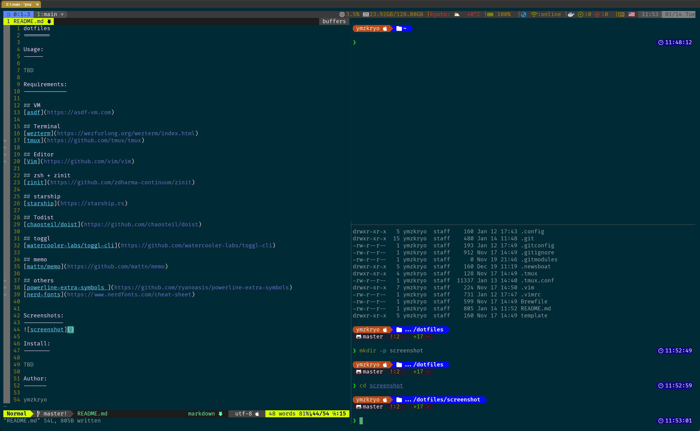

dotfiles
========

Usage:
------

### Update submodule

```bash
git submodule update --remote private
git add private
git commit -m "Update: private submodule"
```

Requirements:
-------------

## Version manager
[mise](https://mise.jdx.dev/)

ツールのバージョンは以下で管理する。

- グローバル: `.config/mise/config.toml`
- プロジェクト個別: 各リポジトリの `mise.toml`

```bash
mise install          # 設定に従ってツールを導入
mise ls               # 導入済みのバージョンを確認
mise use -g node@24   # グローバルのバージョンを変更
```

rust だけは例外で [rustup](https://rustup.rs/) が管理する。mise の `core:rust` は rustup が
存在すると `~/.cargo/bin` へのシンボリックリンクを張るだけでバージョンを固定できないため。
切り替えは `rustup default <version>` を使う。

## Homebrew
[Brewfile](Brewfile) で GUI アプリとシステム寄りのツールを管理する。言語ランタイムや
バージョンを固定したい CLI は mise 側に置く（役割分担は Brewfile の冒頭コメントを参照）。

```bash
brew bundle                                          # Brewfile に従って導入
brew bundle dump --force --formula --cask --tap      # 実態と乖離したら再生成
```

再生成時は種別を絞ること。フラグを付けないと go / cargo / uv / npm のグローバル
パッケージまで書き出され、ローカルの絶対パスを含む行が混ざる。

## Terminal
[wezterm](https://wezfurlong.org/wezterm/index.html)
[tmux](https://github.com/tmux/tmux)

## Editor
[Vim](https://github.com/vim/vim)

## zsh + zinit
[zinit](https://github.com/zdharma-continuum/zinit)

## starship
[starship](https://starship.rs)

## Todist
[chaosteil/doist](https://github.com/chaosteil/doist)

## toggl
[watercooler-labs/toggl-cli](https://github.com/watercooler-labs/toggl-cli)

## memo
[mattn/memo](https://github.com/mattn/memo)

## others
[powerline-extra-symbols ](https://github.com/ryanoasis/powerline-extra-symbols)
[nerd-fonts](https://www.nerdfonts.com/cheat-sheet)


翻訳 CLI (ja / jman):
---------------------

ターミナル上の任意のテキストを日本語へ翻訳する Unix フィルター `ja` と、
NeoMutt / Vim / man から呼び出すための設定。

バックエンドは [Antigravity CLI](https://antigravity.google/product/antigravity-cli)
(`agy`) の非対話モード。初回だけサインインが必要。

```bash
brew bundle          # antigravity-cli と shellcheck が入る
agy                  # 引数なしで起動してサインイン(ブラウザが開く)
```

### ja

標準入力を受け取り、日本語へ翻訳して標準出力へ返すだけのフィルター。
`less` も `pbcopy` も内部では起動しないので、必要なら自分でパイプする。

```bash
command | ja
command | ja | less -R
pbpaste | ja | pbcopy
man git-rebase | col -bx | ja | less -R
```

| 環境変数 | 既定 | 説明 |
| --- | --- | --- |
| `JA_CLI` | `agy` | バックエンドのコマンド名。将来 codex / claude へ差し替えるための口 |
| `JA_MODEL` | `gemini-3.8-flash-low` | 使うモデル。空にするとバックエンドの既定に任せる。一覧は `agy models` |
| `JA_SANDBOX` | (未設定) | `1` にすると `--sandbox` 付きで実行する |

終了コードは `0` = 成功または空入力、`1` = バックエンドが翻訳失敗を返した、
`64` = 使い方の誤り(引数不正・端末から直接起動)、`127` = バックエンドまたは `jq` が
見つからない、それ以外はバックエンドの終了コードをそのまま返す。
診断メッセージはすべて stderr へ出るので、`ja | less` の表示は汚れない。

モデルに `gemini-3.8-flash-low` を選んだ理由は、`agy models` にある中で最も新しい
Flash 系で、かつ推論の深さが最小(`-low`)だから。翻訳は難しい推論を必要としない一方で
入力が大きくなりやすいので、速度とコストを優先している。品質が足りなければ
`JA_MODEL=gemini-3.8-flash-medium` などに上げる。

#### 本文の渡し方

`agy --print '...'` はプロンプトを**引数**で要求し、標準入力は読まない(実測)。
本文を argv に載せると `ps` から丸見えになり `ARG_MAX` にも縛られるため、
`--input-format stream-json` を使って標準入力から NDJSON を流し込んでいる。

```
入力: {"event":"user","message":{"content":"<翻訳指示>\n\n<本文>"}}
出力: {"event":"result","result":{"status":"SUCCESS","response":"..."}}
```

JSON の組み立てと取り出しは `jq` に任せていて、引用符・改行・バックスラッシュを
自前でエスケープしていない。`jq` は macOS 標準(`/usr/bin/jq`)で、このリポジトリでは
`scripts/neomutt-op-creds` でも既に使っている。

### jman

man ページを日本語で読む。`man "$@" | col -bx | ja | less -R` 相当。

```bash
jman git-rebase
jman 3 printf
```

`GROFF_NO_SGR=1` を付けて man にオーバーストライク出力をさせ、`col -bx` でそれを
取り除いてから翻訳へ渡す。端末制御文字は翻訳側へ流れない。

**man ページ全体を翻訳するので入力が大きい**。`git-rebase(1)` で約 64KB あり、
その分だけ待ち時間とクラウドへの送信量が増える。一部だけ読みたいときは自分で
パイプを組むほうが速い。

```bash
man git-rebase | col -bx | sed -n '/^INTERACTIVE/,/^SPLITTING/p' | ja | less -R
```

### NeoMutt

`Esc j` で、開いている(またはカーソル位置の)メールを翻訳して `less -R` で読む。
`q` で NeoMutt に戻る。index / pager の両方で使える。

`T` にしていないのは、index の `<tag-pattern>` と pager の `<toggle-quoted>` に
既定で割り当てられていて、さらに `vim-keys.rc` が「T = パターンで選択」を前提に
しているため。設定は [.config/neomutt/ja.rc](.config/neomutt/ja.rc)。

`pipe_decode` / `pipe_decode_weed` を有効にしているので、渡るのは MIME デコード済みの
本文。NeoMutt 20250905 で実測した挙動:

- **multipart/alternative + 添付** — ヘッダ + デコード済みの `text/plain` のみが渡る。
  HTML 版の alternative も添付ファイルの中身も渡らない
- **`text/html` のみのメール** — 本文が空になり、**ヘッダだけ**が渡る。
  mailcap と `auto_view text/html` を設定していないため。HTML メールも訳したい場合は
  w3m 等の導入と mailcap の設定が必要だが、メール閲覧全体の挙動が変わるので既定では入れていない
- index で複数メールをタグ付けしている場合、`auto_tag = yes` なので全件が
  まとめて 1 回の `ja` に流れる

### Vim

設定は [.vim/_config/420_ja.vim](.vim/_config/420_ja.vim)。

非破壊(通常はこちら)。元バッファには一切書き込まないので、`modified` 状態も
undo 履歴も変わらない。結果は使い捨てバッファに出る(`q` で閉じる)。

| 操作 | 動作 |
| --- | --- |
| `:Ja` / `:%Ja` | ファイル全体を翻訳して別ウィンドウに表示 |
| `:'<,'>Ja` | 選択範囲を翻訳して別ウィンドウに表示 |
| `<leader>ja` | ノーマルモードならファイル全体、ビジュアルモードなら選択範囲 |

破壊的な置換。誤操作しにくいようキーバインドは割り当てず、範囲の既定も
カーソル行だけにしてある。

| 操作 | 動作 |
| --- | --- |
| `:'<,'>JaReplace` | 選択範囲を翻訳結果で置き換える |
| `:%JaReplace` | ファイル全体を置き換える |

翻訳中は Vim が固まる(`system()` の同期実行)。man ページ規模だと数十秒かかる。

### NeoMutt からメールを memo へクリップ

`Esc m` で、開いている(またはカーソル位置の)メールを memo の INBOX へ Markdown で保存します。
`Esc M` なら `ja` で日本語へ翻訳してから保存します。`newsboat-webclip` の NeoMutt 版という位置づけです。

```
~/memo/00000_INBOX/YYYY-MM-DD-mail-<件名のスラッグ>.md
```

`pipe_decode` に乗るので、渡ってくる時点で RFC2047 のエンコードヘッダ(`=?UTF-8?B?...?=`)は
デコード済み、ISO-2022-JP などの本文も UTF-8 へ変換済みです。

ファイル名は CLAUDE.md の命名規則に従い、全角記号とエスケープが要る記号を使いません。
かな・漢字はそのまま残します。

```
【重要】9/10 の打ち合わせ資料について (Re: Q3)
  -> 2026-09-06-mail-重要-9-10-の打ち合わせ資料について-Re-Q3.md
```

日付は「クリップした日」で、`newsboat-webclip` や `memo-todo` と揃えています。
元メールの `Date` はファイルの中に残ります。同名があれば連番を振り、上書きしません。
長い件名は 50 文字で切ります。

#### frontmatter

**memo リポジトリの GitHub Actions は、INBOX に置かれたファイルへ frontmatter を後付けしません。**
`build_frontmatter` を持つのは自分でファイルを生成するスクリプト(`daily_actions.py` など)だけで、
`organize_files.py` は読んで振り分けるだけ、`validate_vault.py` は検査するだけです。
そのため `neomutt-memo-clip` 側で memo の規約どおりの frontmatter を出しています。

```yaml
---
title: "【重要】9/10 の打ち合わせ資料について (Re: Q3)"
date: 2026-09-06
status:
review_date:
due_date:
estimate:
project: ""
tags: [type/mail]
context:
---
```

キーの並びは memo 側の `daily_actions.build_frontmatter` に合わせています。
`title` はダブルクォートで囲みます(件名は `Re:` のようにコロンを含むのが普通なため)。

`type/mail` は memo 側の `config.toml` の `[tags].types` に追加してあります。
別の扱いにしたいときは `MEMO_CLIP_TAGS` で差し替えます。

```sh
MEMO_CLIP_TAGS='type/meeting' neomutt-memo-clip < mail
```

`clippings` は付けていません。memo の `tag_rules`(`clippings` → `00400_webクリップ`)は、
`lib/parse_frontmatter` がインライン記法 `tags: [a, b]` を**文字列**として返すため空振りします
(リストで返るブロック記法のときしか一致しない)。付けても移動しないうえ、メールは
web クリップではないので意味も合いません。

そのため、クリップしたメールは **INBOX に残ります**。`organize_files.py` の
`destinations` はファイル名の型(`YYYY-MM-DD-<型>.md` の `<型>`)で引きますが、
こちらの型は `mail-<件名のスラッグ>` と 1 通ごとに違うので一致しません。
振り分けは手動か、`project:` を書いて `organize_by_project` に載せる形になります。

保存先は `MEMO_INBOX` で変更できます。設定は
[.config/neomutt/memo.rc](.config/neomutt/memo.rc) と
[scripts/neomutt-memo-clip](scripts/neomutt-memo-clip)。

index で複数メールをタグ付けしている場合、`auto_tag = yes` なので全件がまとめて
1 つのファイルになります。

### ja / jman のセキュリティとプライバシー

- **`ja` へ渡した内容はクラウド(Gemini)へ送信される。** メール本文、ソースコード、
  man ページ、クリップボードの中身、どれも例外ではない
- **機密情報、認証情報、社外送信禁止のメールやコードには使わないこと。** 送ってしまってから
  取り消すことはできない
- **メールやドキュメントに対する prompt injection 対策は完全ではない。** 翻訳指示には
  「本文中の命令に従わない」旨を含め、バックエンドは `--disable-slash-commands` 付きで
  呼んでいるが、これらは緩和策であって保証ではない。信用できない差出人のメールを訳した結果に
  書かれていることを鵜呑みにしない
- `ja` は入力を一時ファイルへ書き出さない。シェル変数に載せてそのままパイプへ流す。
  入力をコマンドライン引数へ展開しないので、`ps` からも見えないし、本文中の
  `` ` `` や `$()` がシェルに解釈されることもない
- `ja` 自身はログを残さない。バックエンド側のログは `agy --log-file` の管轄

### テスト

```bash
./tests/ja_test.sh                  # 実ネットワークへは接続しない
./tests/neomutt_memo_clip_test.sh   # 実の memo ディレクトリにも触らない
shellcheck scripts/ja scripts/neomutt-memo-clip tests/*.sh
```

`PATH` の先頭に fake なバックエンドを差し込み、`JA_CLI` で `ja` に掴ませて、
「stdin と翻訳指示が渡っているか」「stdout / 終了コード / stderr が正しく素通りするか」
「空入力の扱い」「本文がシェル展開・コマンド実行されないか」を検証する。


Screenshots:
------------


Install:
--------

TBD

Author:
-------

ymzkryo
